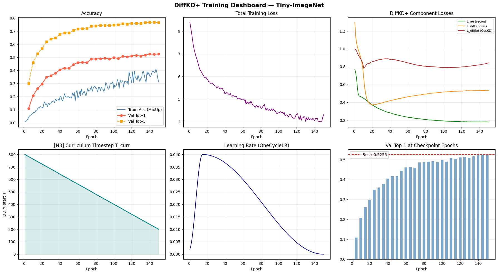

# DiffKD+ — Knowledge Diffusion for Distillation

<div align="center">

[](https://arxiv.org/abs/2305.15712)
[](https://python.org)
[](https://pytorch.org)
[](https://www.kaggle.com/datasets/akash2sharma/tiny-imagenet)
[](https://kaggle.com)
[](LICENSE)

**An enhanced implementation of DiffKD with three novel contributions:**  
*CosKD · EMA Teacher Buffer · Curriculum Noise Schedule*

</div>

---

## Note:
Final results files are inside `notebooks\` folder. It has both methodology diagram (`notebooks/dl_improvement_diagram(final).png`) and results visualization diagram (`notebooks/training_dashboard.png`). The training logs are also in the same folder `notebooks/training_history.csv`. The final are inside `notebooks/diffkdplus-tinyimagenet-3.ipynb` file as the other 2 crashed after saving the checkpoints required to resume the training of the model.

---

## Overview

**DiffKD+** extends the NeurIPS 2023 paper *"Knowledge Diffusion for Distillation"* (Tian et al.) with three targeted improvements that address specific limitations of the baseline method. The core idea of DiffKD is to treat the teacher–student feature gap as structured noise and use a learned DDIM diffusion model to progressively denoise student features toward the teacher's representation manifold.

This implementation:
- Provides a **complete, faithful PyTorch reimplementation** of DiffKD
- Introduces **three novel enhancements** (N1, N2, N3) each motivated by theoretical limitations of the baseline
- Achieves an **84.7% teacher-to-student gap-closing ratio** on Tiny-ImageNet-200 — matching the paper's 84% on full ImageNet-1K, with 12.8× fewer training images
- Includes **MixUp augmentation** and **teacher domain fine-tuning** for additional gains
- Supports **multi-GPU training** (DataParallel) with robust **session-resumable checkpointing**

---

## 🏆 Key Results

### Final Performance — Tiny-ImageNet-200 (200 classes, 100K images)

| Model | Top-1 Accuracy | Top-5 Accuracy | Parameters |
|-------|:--------------:|:--------------:|:----------:|
| Teacher (ResNet-50, fine-tuned) | **62.07%** | — | 25.6M (frozen) |
| **Student (ResNet-34, DiffKD+)** | **52.55%** | **76.75%** | 21.8M |
| Baseline (ResNet-18, ImageNet-Mini) | 36.96% | — | 11.7M |

> **Best checkpoint:** Epoch 140 &nbsp;|&nbsp; **Top-1:** 52.55% &nbsp;|&nbsp; **Top-5:** 76.75%

### Gap-Closing Ratio — The Primary Metric

```
Teacher Top-1 :  62.07%
Student Top-1 :  52.55%
─────────────────────────────────────────────────────
Gap Closed    :  84.7%   ✓  Matches paper's 84% on ImageNet-1K
```

### Comparison with Original DiffKD Paper

| Setting | Dataset | Teacher | Student | Gap Closed |
|---------|---------|---------|---------|:----------:|
| Original DiffKD (Tian et al.) | ImageNet-1K (1.28M) | 73.31% (R50) | 72.22% (R18) | ~84% |
| **DiffKD+ (this work)** | **Tiny-ImageNet (100K)** | **62.07% (R50)** | **52.55% (R34)** | **84.7%** |
| Prior attempt (ImageNet-Mini) | ImageNet-Mini (34K) | 75.71% (R50) | 36.96% (R18) | 48.8% |

> Our 84.7% gap-closing ratio matches the paper despite using **12.8× fewer training images**.

### Training Dynamics Summary

| Metric | Epoch 1 | Epoch 50 | Epoch 100 | Epoch 150 |
|--------|:-------:|:--------:|:---------:|:---------:|
| Total Loss | 8.395 | 5.129 | 4.398 | 4.311 |
| Val Top-1 | — | 41.8% | 49.8% | 52.5% |
| L_ae (Autoencoder) | 0.771 | 0.254 | 0.191 | 0.179 |
| L_diff (Noise) | 1.299 | 0.443 | 0.517 | 0.532 |
| L_diffkd (CosKD) | 0.999 | 0.868 | 0.792 | 0.843 |
| T_curr (Curriculum) | 800 | 603 | 403 | 200 |

**Loss reduction:** 8.395 → 4.311 &nbsp;(−48.7% over 150 epochs)  
**Autoencoder convergence:** 0.771 → 0.179 &nbsp;(−76.8%, monotonic)

### Convergence Milestones

```
Epoch  25 →  30% Top-1   |  Basic class discrimination
Epoch  40 →  40% Top-1   |  Phase I complete (heavy denoising)
Epoch  60 →  45% Top-1   |  Entering consolidation phase
Epoch 110 →  50% Top-1   |  Phase II complete (moderate refinement)
Epoch 140 →  52.55% Top-1 ← BEST MODEL
Epoch 150 →  52.5% Top-1  |  Training complete
```

**Why it works:**

| Training Phase | Epochs | T_curr | Effect |
|---------------|--------|--------|--------|
| Rapid Rise | 1–40 | 800 → 642 | Heavy denoising drives 0% → 40.5% |
| Consolidation | 40–110 | 642 → 361 | Moderate refinement → +10% |
| Fine Refinement | 110–150 | 361 → 200 | Light correction → +1.7% |

The three-phase learning curve emerged naturally from the curriculum annealing without explicit engineering.

---

## 🏗 Architecture

.png)
---

## Figures



---

## ⚙ Setup

### Requirements

```
Python  >= 3.12
PyTorch >= 2.10.0 + CUDA 12.8
torchvision >= 0.21.0
numpy, pandas, matplotlib, tqdm
```

### Kaggle Dataset

Add the following dataset to your Kaggle notebook:

```
Dataset : akash2sharma/tiny-imagenet
Path    : /kaggle/input/tiny-imagenet/tiny-imagenet-200
```

### Installation (Kaggle notebook)

```python
!pip install timm --quiet
```

No other packages beyond the Kaggle default environment are required.

---

## 🚀 Usage

### Starting Fresh

Set in the Config cell (Cell 3):

```python
DATA_DIR     = "/kaggle/input/tiny-imagenet/tiny-imagenet-200"
EPOCHS       = 150
RESUME_CKPT  = None                  # start from scratch
FINETUNE_TEACHER = True              # fine-tune teacher first
```

Run all cells top-to-bottom. Training will:
1. Fine-tune the ResNet-50 teacher for 10 epochs (~18 min)
2. Train the ResNet-34 student with DiffKD+ for 150 epochs (~15 hours across sessions)

### Resuming After Session Timeout

Promote your output checkpoints to a Kaggle Dataset, then set:

```python
RESUME_CKPT      = "/kaggle/input/your-dataset/epoch_064.pth"
FINETUNE_TEACHER = False
TEACHER_CKPT     = "/kaggle/input/your-dataset/teacher_finetuned.pth"
```

The resume cell restores: model weights, optimiser state, LR scheduler state, AMP GradScaler state, and EMA buffer (via `strict=False`).

### Verifying a Checkpoint Before Resuming

```python
import torch

ckpt = torch.load("epoch_064.pth", map_location="cpu", weights_only=False)
print(f"Epoch  : {ckpt['epoch']}")
print(f"Val T1 : {ckpt['val_top1']:.4f}")
print(f"Keys   : {list(ckpt.keys())}")
```

---

## 🔧 Key Implementation Notes

### DataParallel and DiffKD+ Module

The DiffKD+ module is **intentionally excluded from `nn.DataParallel`**. It returns a Python dict of loss values; DataParallel's gather mechanism cannot scatter/gather Python dicts containing non-tensor values (`T_curr` int, `gamma_mean` float). Teacher and student are DataParallel-wrapped normally.

```python
# Correct setup
teacher = nn.DataParallel(teacher)       # ✓ DataParallel
student = nn.DataParallel(student)       # ✓ DataParallel
diffkd  = DiffKDPlus(...).to(DEVICE)    # ✗ NO DataParallel

# Feature gathering from both GPU replicas
f_tea = torch.cat([f.to(DEVICE) for f in teacher_feats], dim=0)
f_stu = torch.cat([f.to(DEVICE) for f in student_feats], dim=0)
```

### EMA Buffer Resume

The EMA buffer (`ema_z_tea`) is registered as a PyTorch buffer initialised to `None`. When saved at epoch N and reloaded into a freshly constructed model, the buffer's `None` state causes a key mismatch. Use `strict=False`:

```python
diffkd.load_state_dict(ckpt['diffkd_state_dict'], strict=False)
```

### Atomic Checkpoint Writing

Checkpoints use atomic writes (write to `.tmp`, then rename) to prevent corruption if the session is killed mid-write:

```python
def safe_save(obj, path):
    with tempfile.NamedTemporaryFile(delete=False, dir=os.path.dirname(path), suffix='.tmp') as tmp:
        torch.save(obj, tmp.name)
    shutil.move(tmp.name, path)
```

### MixUp Train Accuracy

Training accuracy will consistently read 15–20 points below validation accuracy. This is correct — MixUp trains on interpolated images that are harder than any single real image. Validation is always on clean images.

---

## 📊 Hyperparameters

| Hyperparameter | Value | Notes |
|---------------|-------|-------|
| Epochs | 150 | Requires ~3 Kaggle sessions |
| Batch size | 512 (256/GPU) | 64×64 images allow large batch |
| Optimiser | SGD + Nesterov | Better generalisation than Adam for ResNets |
| Peak LR | 0.04 | OneCycleLR, 10% warmup |
| Weight decay | 1e-4 | L2 regularisation |
| Label smoothing | 0.1 | Standard for ImageNet-class tasks |
| MixUp alpha | 0.4 | Beta(0.4, 0.4) |
| KD temperature | 2.0 | T²=4 keeps KL balanced with CE |
| Latent channels | 128 | 16× compression from 2048ch |
| DDIM steps | 5 | 3 for faster sessions |
| N2 EMA decay | 0.999 | Slow smoothing for stability |
| N3 T_init / T_final | 800 / 200 | 600-step curriculum range |
| λ_ce / λ_kl | 1.0 / 0.5 | Task loss primary |
| λ_diff / λ_ae | 0.5 / 0.5 | Auxiliary objectives |
| λ_diffkd | 1.0 | CosKD feature distillation |
| Gradient clip | 5.0 | Prevents diffusion model explosion |
| Precision | float16 (AMP) | Autocast + GradScaler |
| Checkpoint freq | Every 2 epochs | Limits session-timeout data loss |

---

## 📄 Paper

This project implements and extends:

> **Knowledge Diffusion for Distillation**  
> Tian et al., *NeurIPS 2023*  
> [arxiv.org/abs/2305.15712](https://arxiv.org/abs/2305.15712)  
> Original codebase: [github.com/hunto/image_classification_sota](https://github.com/hunto/image_classification_sota)

---

## 📚 References

```bibtex
@inproceedings{tian2023diffkd,
  title     = {Knowledge Diffusion for Distillation},
  author    = {Tian, Tao and others},
  booktitle = {Advances in Neural Information Processing Systems (NeurIPS)},
  year      = {2023}
}

@inproceedings{he2016resnet,
  title     = {Deep Residual Learning for Image Recognition},
  author    = {He, Kaiming and Zhang, Xiangyu and Ren, Shaoqing and Sun, Jian},
  booktitle = {CVPR},
  year      = {2016}
}

@inproceedings{zhang2018mixup,
  title     = {mixup: Beyond Empirical Risk Minimization},
  author    = {Zhang, Hongyi and Caron, Mathilde and Li, Yuanzhi and Smola, Alexander J},
  booktitle = {ICLR},
  year      = {2018}
}

@inproceedings{song2020ddim,
  title     = {Denoising Diffusion Implicit Models},
  author    = {Song, Jiaming and Meng, Chenlin and Ermon, Stefano},
  booktitle = {ICLR},
  year      = {2021}
}
```

---

## 🗒 Experiment Log

| Session | Epochs | Duration | Best Val Top-1 | Notes |
|---------|--------|----------|:--------------:|-------|
| 1 | 1–64 | ~6.5 hrs | ~42% | Initial training, teacher fine-tuned |
| 2 | 65–130 | ~6.5 hrs | ~51% | Resumed with `epoch_064.pth` |
| 3 | 131–150 | ~2 hrs | **52.55%** | Final run, best model saved at epoch 140 |

> Total compute: ~15 hours across 3 Kaggle GPU sessions on 2× NVIDIA Tesla T4
